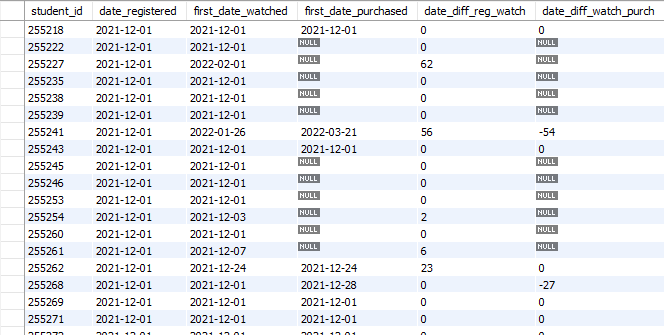

# Calculating-Free-to-Paid-Conversion-Rate-with-SQL
## Introduction
This project is an unguided project that allowed me to use SQL skills that I learned through 365 Data Science's MySQL course. 
We get to download the project files and work with the dataset from there. Pnce all tasks are complete, I'll have found the answers to the following questions:
- What is the free-to-paid conversion rate of students who have watched a lecture on the 365 platform?
- What is the average duration between the registration date and when a student has watched a lecture for the first time (date of first-time engagement)?
- What is the average duration between the date of first-time engagement and when a student purchases a subscription for the first time (date of first-time purchase)?
- How can we interpret these results, and what are their implications?
## Instructions
### Create the Subquery
Import the db_course_conversions database—stored in the db_course_conversions.sql file—into your schemas and study its content. Then, by appropriately joining and aggregating the tables, create a new result dataset comprising the following columns:
- student_id – (int) the unique identification of a student
- date_registered – (date) the date on which the student registered on the 365 platform
- first_date_watched – (date) the date of the first engagement
- first_date_purchased – (date) the date of first-time purchase (NULL if they have no purchases)
- date_diff_reg_watch – (int) the difference in days between the registration date and the date of first-time engagement
- date_diff_watch_purch – (int) the difference in days between the date of first-time engagement and the date of first-time purchase (NULL if they have no purchases)</br></br>
**Hint:** *Research the DATEDIFF function in MySQL*
Note the Venn diagram below.


In order to do this, I know I want to get the student_id, date_registered, first_date_watched, first_date_purchased, date_diff_reg_watch, date_diff_watch_purch.
First, I'll select all the columns I want to see:
```sql
SELECT 
    i.student_id,
    i.date_registered,
    MIN(date_watched) AS first_date_watched,
    MIN(date_purchased) AS first_date_purchased,
    DATEDIFF(MIN(date_watched), MIN(date_registered)) AS date_diff_reg_watch,
    DATEDIFF(MIN(date_watched), MIN(date_purchased)) AS date_diff_watch_purch
```
Then, I need to join them together. Looking at the Venn diagram, I know I need to JOIN the student info FROM student engagement, and the student purchase dates, can be LEFT JOINed becuase not all students made a purchase. They can all be linked through the student ID. 
I also want to GROUP the student ID together because one, we are using aggregate functions, and two, students can have engaged with the course multiple times - so we only want to know if they have or havn't engaged. 
We can get the information we are looking for through the following way:
```sql
FROM student_engagement e
JOIN student_info i ON e.student_id = i.student_id
LEFT JOIN student_purchases p ON e.student_id = p.student_id
GROUP BY i.student_id
```
And finally, the objective is to determine the conversion rate of students *who have already watched a lecture*. Therefore, filter the result dataset so that the date of first-time engagement comes before (or is equal to) the date of first-time purchase.</br>
**Sanity check:** *The number of records in the resulting set should be 20,255*.
At first I was confused because I would have the following code:
```sql
HAVING first_date_watched <= first_date_purchased;
```
...and only having this code would result in 2,286 rows. But after taking a break and coming back to it a few days later, I understood that we wanted to know the conversion; so we would also want to display students who didn't purchase the course at all. 
This can be done by modifying the code to the following:
```sql
HAVING first_date_watched <= first_date_purchased
	OR first_date_purchased IS NULL;
```
So the whole query will look like the following:
```sql
SELECT 
    i.student_id,
    i.date_registered,
    MIN(date_watched) AS first_date_watched,
    MIN(date_purchased) AS first_date_purchased,
    DATEDIFF(MIN(date_watched), MIN(date_registered)) AS date_diff_reg_watch,
    DATEDIFF(MIN(date_watched), MIN(date_purchased)) AS date_diff_watch_purch
FROM student_engagement e
JOIN student_info i ON e.student_id = i.student_id
LEFT JOIN student_purchases p ON e.student_id = p.student_id
GROUP BY i.student_id
HAVING first_date_watched <= first_date_purchased
	OR first_date_purchased IS NULL;
```
Now, our output should show something like this:


### Create the Main Query
Now that the temporary result set adheres to the Venn diagram and displays the columns we wanted, the next task is to use the subquery and retrieve the following three metrics:
- **Free-to-paid Conversion Rate:**</br>
This metric measures the proportion of engaged students who choose to benefit from full course access on the 365 platform by purchasing a subscription after watching a lecture. It is calculated as the ratio between:
- The number of students who watched a lecture and purchased a subscription on the same day or later.
- The total number of students who have watched a lecture.
- Convert the result to percentages and call the field conversion_rate.

</br>

- **Average Duration Between Registration and First-Time Engagement:**</br>
This metric measures the average duration between the date of registration and the date of first-time engagement. This will tell us how long it takes, on average, for a student to watch a lecture after registration. The metric is calculated by finding the ratio between:
- The sum of all such durations.
- The count of these durations, or alternatively, the number of students who have watched a lecture.
- Call the field av_reg_watch.

</br>

- **Average Duration Between First-Time Engagement and First-Time Purchase:**</br>
This metric measures the average time it takes individuals to subscribe to the platform after viewing a lecture. It is calculated by dividing:
- The sum of all such durations.
- The count of these durations, or alternatively, the number of students who have made a purchase.
- Call the field av_watch_purch.

